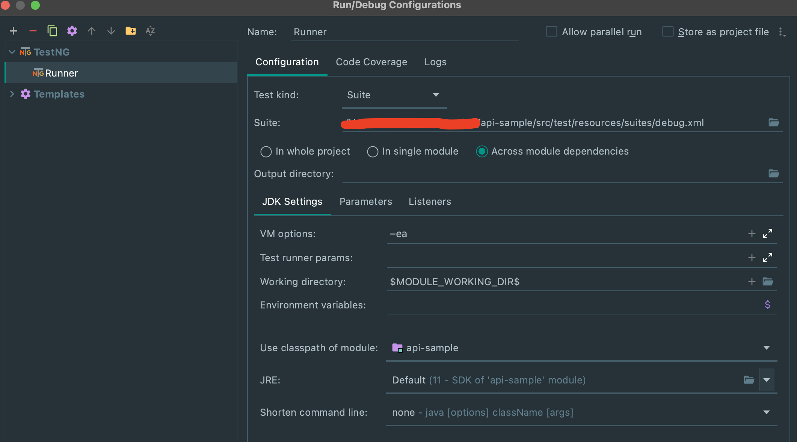

## Getting Started

### 1. Dependencies Requirements

- **JDK Version**: 11, you can download either from
  here [JDK11](https://www.oracle.com/java/technologies/javase-jdk11-downloads.html) and setting up the JAVA_HOME
  environment variable. For more information, please look at
  this [Instruction](https://mkyong.com/java/how-to-set-java_home-environment-variable-on-mac-os-x/).
  &nbsp;
- **IDE**: Please use your Java IDE that you feel familiar with, e.g: Eclipse, IntelliJ, NetBeans,...
- **Maven**: Build Tool for this Framework.
- **Lombok**: This is the Library for Trimming down the redundancy of POJO classes which will make the framework look
  repetitive in the long run. For more information, please go to this Link for more details
  on [Project Lombok](https://projectlombok.org/).
- **Cucumber For Java**: You can go to IDE's Plugins store to download Cucumber for Java Plugin.

### 2. Test Execution
- Access **/src/test/DebugRunner.java** to execute our test.
```java
@CucumberOptions(
        features = "src/test/resources/features",
        glue = {"shane.testing.hook",
                "shane.testing.steps"}, plugin = {"pretty", 
        "html:target/cucumber-core-test-report.html",
        "pretty:target/cucumber-core-test-report.txt", 
        "json:target/cucumber-core-test-report.json",
        "junit:target/cucumber-core-test-report.xml"},
        tags = "@SearchWeather",
        dryRun = false,
        monochrome = true,
        objectFactory = TestObjectFactory.class)
public class DebugRunner extends Runner {
}
```
- Open execute configuration
- Create TestNG runner
- Change **Test kind** to **Suite**
- Update the value in **Suite** to **/src/test/resources/suites/debug.xml**
